# Story Generation Process Visual Diagram

## Complete Process Flow

```mermaid
flowchart TD
    %% User Input
    A[🎯 User Input<br/>Feature Description] --> B[🔍 Feature Analysis]

    %% TAWOS Data Retrieval
    B --> C[📊 TAWOS Data Retrieval]
    C --> D[🔎 Vector Search<br/>Similar Stories]
    D --> E[📈 Extract Success Patterns]
    D --> F[⚠️ Extract Anti-patterns]

    %% Context Building
    E --> G[🧠 Build Enhanced Context]
    F --> G
    G --> H[👥 Team Context Integration]

    %% AI Generation
    H --> I[🤖 Claude API Generation]
    I --> J[📝 JSON Response]

    %% Parsing & Validation
    J --> K{✅ Parse Success?}
    K -->|Yes| L[🔧 Validate & Enhance]
    K -->|No| M[🔄 Generate Fallback]
    L --> N[👤 Team Assignment]
    M --> N

    %% Final Output
    N --> O[📊 Priority Scoring]
    O --> P[🎉 Enhanced Stories]

    %% TAWOS Training Process
    subgraph "🔄 TAWOS Training Loop"
        Q[📋 Jira Export Data] --> R[🧹 Data Cleaning]
        R --> S[🔤 Text Processing]
        S --> T[🧮 Embedding Generation]
        T --> U[💾 Vector Database Storage]
        U --> V[📊 Pattern Analysis]
        V --> W[✅ Success/Anti-pattern Extraction]
    end

    %% Vector Search Details
    subgraph "🔍 Vector Search Process"
        X[📝 Query Text] --> Y[🧮 Generate Query Embedding]
        Y --> Z[🔍 Similarity Search]
        Z --> AA[📊 Filter High-Success Patterns]
        AA --> BB[⚠️ Collect Anti-patterns]
    end

    %% Story Enhancement
    subgraph "✨ Story Enhancement"
        CC[📋 Apply Success Patterns] --> DD[👥 Team Skill Matching]
        DD --> EE[⚖️ Priority Weight Calculation]
        EE --> FF[📝 Generate Acceptance Criteria]
    end

    %% Styling
    classDef inputClass fill:#e1f5fe,stroke:#01579b,stroke-width:2px
    classDef processClass fill:#f3e5f5,stroke:#4a148c,stroke-width:2px
    classDef decisionClass fill:#fff3e0,stroke:#e65100,stroke-width:2px
    classDef outputClass fill:#e8f5e8,stroke:#1b5e20,stroke-width:2px
    classDef tawosClass fill:#fce4ec,stroke:#880e4f,stroke-width:2px

    class A inputClass
    class B,C,D,E,F,G,H,I,J processClass
    class K decisionClass
    class L,M,N,O,P outputClass
    class Q,R,S,T,U,V,W,X,Y,Z,AA,BB,CC,DD,EE,FF tawosClass
```

## TAWOS Data Training Process

## Story Generation with TAWOS Integration

## Team Assignment Algorithm

```mermaid
flowchart LR
    A[📋 Story Requirements] --> B[🔍 Skill Matching]
    A --> C[📊 Level Matching]
    A --> D[👥 Role Alignment]

    B --> E[⚖️ Skill Score<br/>60% Weight]
    C --> F[⚖️ Level Score<br/>30% Weight]
    D --> G[⚖️ Role Score<br/>10% Weight]

    E --> H[🧮 Calculate Total Score]
    F --> H
    G --> H

    H --> I[🏆 Select Best Match]
    I --> J[✅ Assign Team Member]

    classDef inputClass fill:#e1f5fe,stroke:#01579b,stroke-width:2px
    classDef processClass fill:#f3e5f5,stroke:#4a148c,stroke-width:2px
    classDef outputClass fill:#e8f5e8,stroke:#1b5e20,stroke-width:2px

    class A inputClass
    class B,C,D,E,F,G,H processClass
    class I,J outputClass
```

## Priority Scoring System

## Quality Improvement Metrics

```mermaid
graph LR
    subgraph "Before TAWOS"
        A1[📉 60-70% Completion Rate]
        A2[📊 ±40% Story Points Variance]
        A3[⏰ ±60% Time Estimation Variance]
        A4[❓ Generic Templates]
    end

    subgraph "After TAWOS"
        B1[📈 85-90% Completion Rate]
        B2[📊 ±15% Story Points Variance]
        B3[⏰ ±20% Time Estimation Variance]
        B4[✅ Pattern-Based Generation]
    end

    A1 -.->|+25%| B1
    A2 -.->|+25%| B2
    A3 -.->|+40%| B3
    A4 -.->|Context-Aware| B4

    classDef beforeClass fill:#ffebee,stroke:#c62828,stroke-width:2px
    classDef afterClass fill:#e8f5e8,stroke:#2e7d32,stroke-width:2px

    class A1,A2,A3,A4 beforeClass
    class B1,B2,B3,B4 afterClass
```

## FBI Sentinel Anti-pattern Detection

```mermaid
flowchart TD
    A[📝 Story Text] --> B{🔍 Contains Vague Words?}
    A --> C{📦 Multiple Features?}
    A --> D{🔗 Missing Dependencies?}
    A --> E{⚡ Unrealistic Estimates?}

    B -->|Yes| F[⚠️ Requirements Confusion]
    C -->|Yes| G[⚠️ Scope Overload]
    D -->|Yes| H[⚠️ Missing Dependencies]
    E -->|Yes| I[⚠️ Unrealistic Estimates]

    F --> J[🔄 Suggest Refinement]
    G --> J
    H --> J
    I --> J

    J --> K[✅ Improved Story Quality]

    classDef warningClass fill:#fff3e0,stroke:#e65100,stroke-width:2px
    classDef improvementClass fill:#e8f5e8,stroke:#2e7d32,stroke-width:2px

    class F,G,H,I warningClass
    class K improvementClass
```

## Vector Database Architecture

```mermaid
graph TB
    subgraph "Supabase Vector Database"
        A[📊 tawos_user_stories Table]
        B[🧮 Vector Embeddings<br/>1536 dimensions]
        C[📋 Metadata JSONB]
        D[🔍 Similarity Search Function]
    end

    subgraph "Search Process"
        E[📝 Query Text] --> F[🧮 Generate Embedding]
        F --> G[🔍 Vector Similarity Search]
        G --> H[📊 Return Top Matches]
    end

    A --> B
    A --> C
    A --> D

    E --> F
    F --> G
    G --> H

    classDef dbClass fill:#e3f2fd,stroke:#1565c0,stroke-width:2px
    classDef processClass fill:#f3e5f5,stroke:#4a148c,stroke-width:2px

    class A,B,C,D dbClass
    class E,F,G,H processClass
```

## Success Pattern Examples

## Anti-pattern Detection Examples

